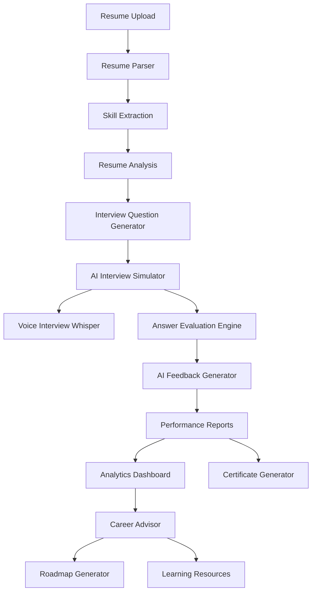
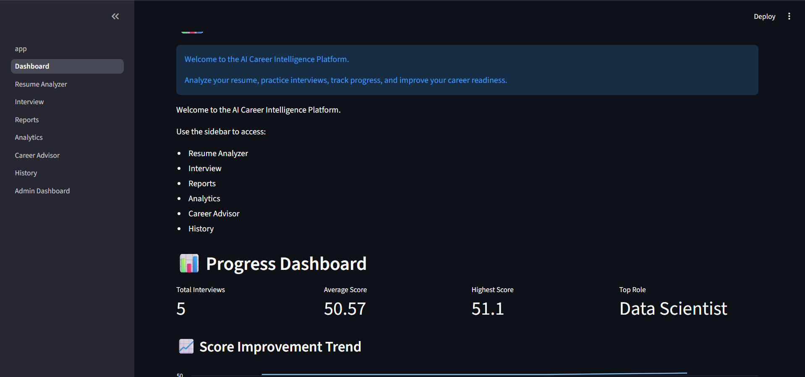
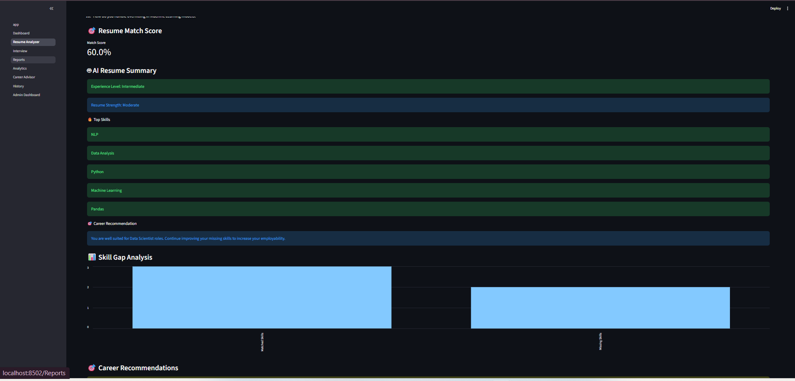
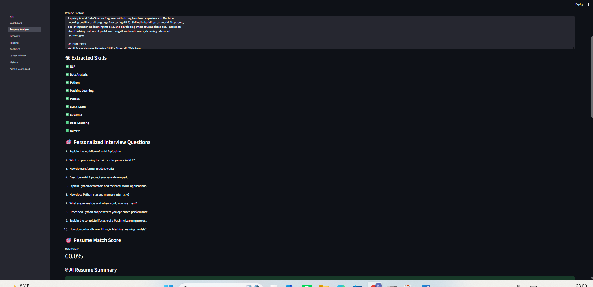
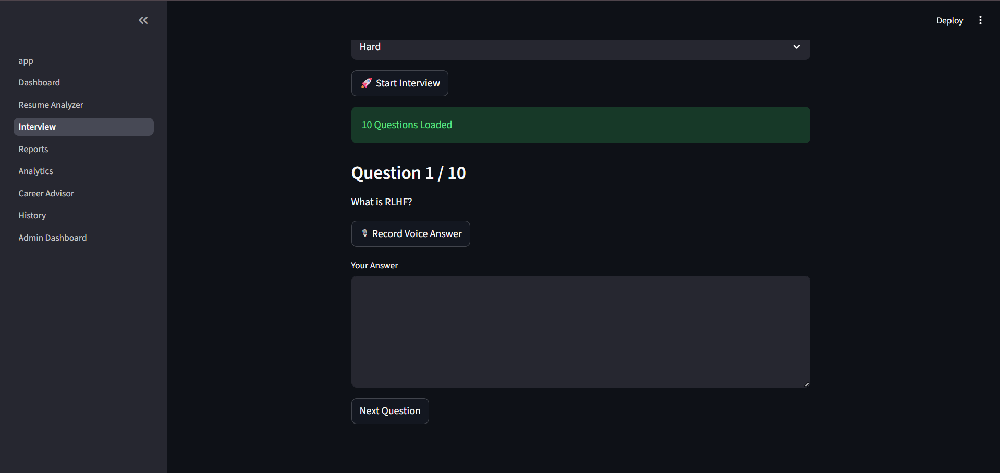
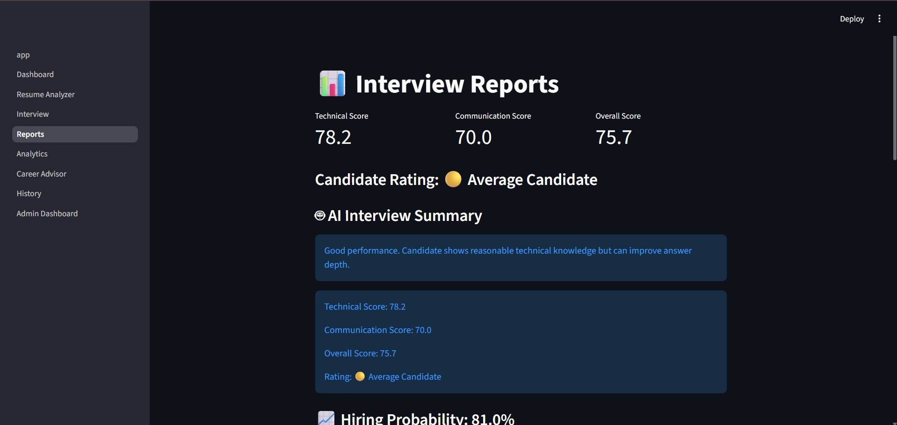
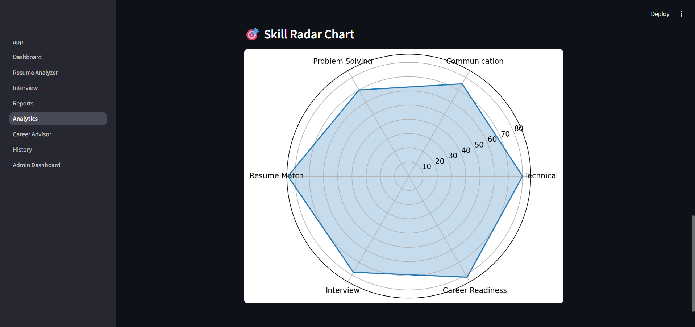

# 🚀 AI Career Intelligence Platform


An AI-powered career preparation platform that helps candidates:

✅ Analyze resumes

✅ Identify skill gaps

✅ Practice AI-generated interviews

✅ Get personalized feedback

✅ Track career readiness

✅ Generate interview reports & certificates

## 🌐 Live Demo

🚀 Try the application here:

https://ai-career-intelligence-platform-pilot.streamlit.app/

## 🏗️ System Architecture



Built with Python, Streamlit, NLP, Machine Learning, Whisper AI, and Sentence Transformers.
## 📸 Application Screenshots

### Dashboard



### Resume Analyzer



### Personalized Questions



### Interview Simulator



### Reports & AI Feedback



### Analytics Dashboard




# 🚀 AI Career Intelligence Platform

An AI-powered career preparation platform that helps candidates analyze resumes, identify skill gaps, practice interviews, receive AI-generated feedback, and track career readiness.

---

## 📌 Features

### 📄 Resume Analyzer

* Resume Upload (PDF, DOCX, TXT)
* Skill Extraction
* Resume Match Score
* Skill Gap Analysis
* AI Resume Summary
* Career Recommendations

### 🎤 AI Interview Simulator

* Dynamic Interview Questions
* Role-Based Questions
* Difficulty Levels
* Personalized Questions from Resume Skills
* Whisper Voice Interview Support

### 📊 AI Evaluation System

* Semantic Answer Scoring
* Communication Score
* Overall Performance Score
* Hiring Probability Prediction
* AI Follow-Up Questions
* AI Interview Summary

### 🧠 Career Advisor

* Career Readiness Assessment
* Skill Gap Detection
* Learning Roadmaps
* Learning Resources

### 📈 Analytics Dashboard

* Performance Metrics
* Progress Tracking
* Skill Radar Chart
* Interview History Analysis

### 🏆 Certificate Generator

* Downloadable PDF Interview Certificate

### 📊 Admin Dashboard

* Interview Statistics
* Performance Overview
* Candidate Analytics

---

## 🛠 Tech Stack

### Frontend

* Streamlit

### Backend

* Python

### Data Processing

* Pandas
* NumPy

### Machine Learning & AI

* Sentence Transformers
* Scikit-Learn
* Whisper
* PyTorch

### Visualization

* Matplotlib

### Database

* SQLite

### Document Processing

* PyPDF2
* python-docx
* ReportLab

---

## 📂 Project Structure

```text
AI_Interview_Simulator/

├── app/
│   ├── pages/
│   ├── utils/
│   └── app.py
│
├── assets/
├── data/
├── reports/
├── models/
├── notebooks/
│
├── interview_history.db
├── requirements.txt
└── README.md
```

---

## ⚙️ Installation

Clone the repository:

```bash
git clone <repository-url>
cd AI_Interview_Simulator
```

Install dependencies:

```bash
pip install -r requirements.txt
```

Run the application:

```bash
streamlit run app/app.py
```

---

## 🎯 Supported Roles

* Data Scientist
* AI Engineer
* Machine Learning Engineer
* Data Analyst

---

## 📈 Key Highlights

* Resume-Based Interview Questions
* AI Career Advisor
* Voice Interview with Whisper
* AI Feedback Engine
* Skill Gap Analysis
* Hiring Probability Prediction
* Interactive Analytics Dashboard
* Interview Completion Certificate

---

## 🚀 Future Enhancements

* LLM-Based Answer Evaluation
* Multi-Language Interviews
* Online Deployment
* User Authentication
* Recruiter Dashboard
* Cloud Database Integration

---

## 👨‍💻 Author

Developed as an AI-powered Career Intelligence and Interview Preparation Platform using Python, Streamlit, Machine Learning, and Generative AI concepts.
